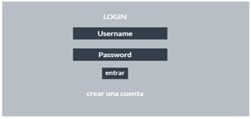
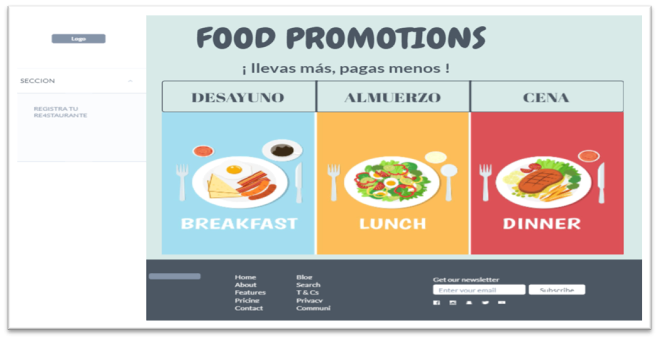
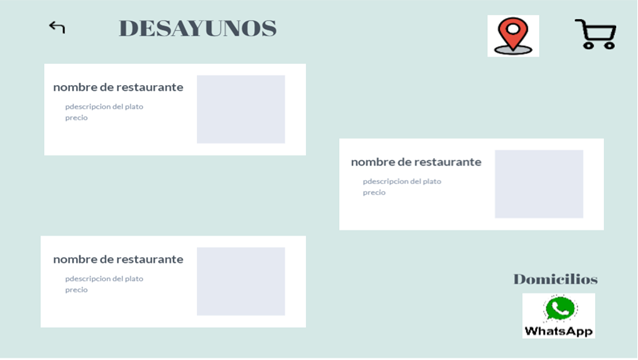
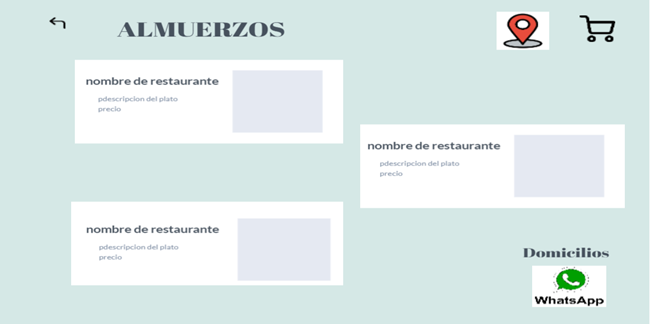
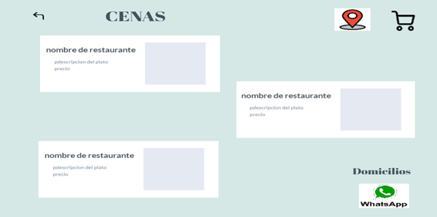
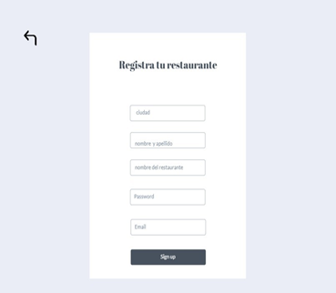
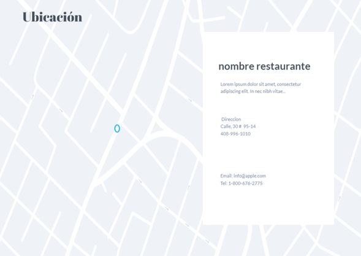

# FOOD-PROMOTIONS

## 9. Mockups

#### Para el diseño de este prototipo se usó Marvel app (https://marvelapp.com), la aplicación cuenta con 9 vistas.

#### Primera Vista

El usuario podrá ingresar con una cuenta de correo y una contraseña; y si este con cuenta con ello entonces procederá a registrarse.

   

#### Segunda Vista

En el registro tendrá que rellenar las opciones que le aparecen que son el nombre, el correo y una contraseña.

  

#### Tercera Vista

En esta sección se mostrarán el título principal de la página, una frase que identifica el proyecto y las opciones con las que se contará (desayunos, almuerzos y cenas), en la parte izquierda habrá la opción de registrar el restaurante, y en la zona inferior habrá la información de los creadores de la página web.

  

#### Cuarta Vista

Desayunos: Se mostrarán el nombre del restaurante y el tipo de promoción que se ofrece, el total de lo que se va comprando se visualizara en la opción carrito que esta en la parte superior derecha, y en la parte inferior izquierda 

  

#### Quinta Vista

Almuerzos. Se mostrarán el nombre del restaurante y el tipo de promoción que se ofrece, el total de lo que se va comprando se visualizara en la opción carrito que está en la parte superior derecha, y en la parte inferior izquierda 

  

#### Sexta Vista

Cenas. Se mostrarán el nombre del restaurante y el tipo de promoción que se ofrece, el total de lo que se va comprando se visualizara en la opción carrito que está en la parte superior derecha, y en la parte inferior izquierda 

  

#### Séptima Vista

También contara con la opción de registrar el restaurante de forma autónoma por el dueño de dicho negocio. 

 

#### Octava Vista

La opcion de Ubicación mostrara los restaurantes cercanos al cliente y de todos los demas locales que ofrecen las promociones.

  

